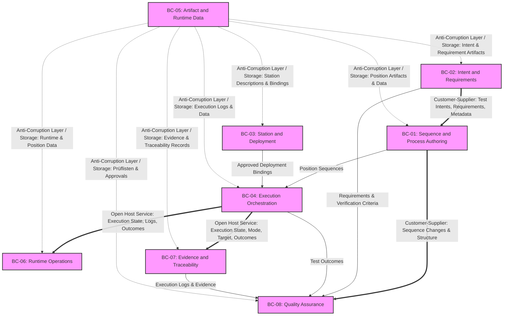
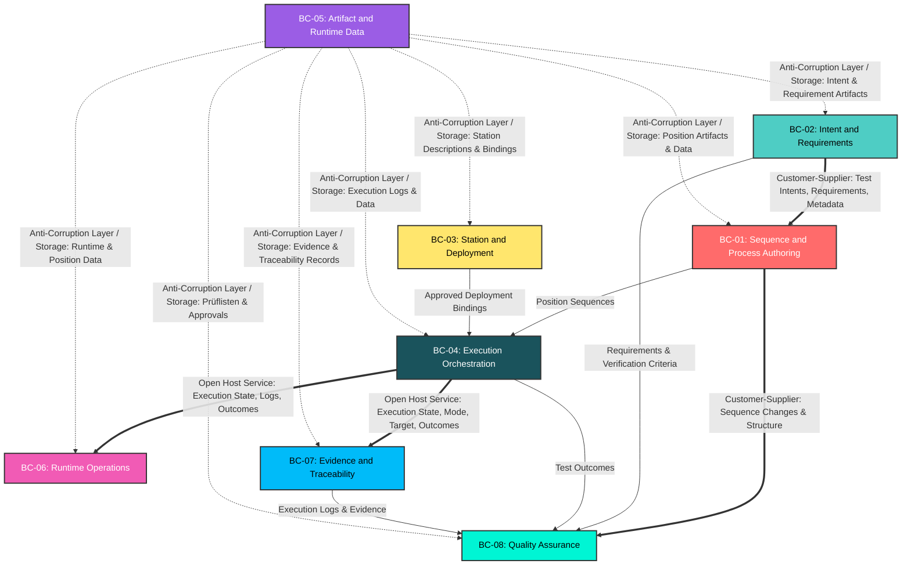

```mermaid
graph TD
    %% Styling
    classDef context fill:#f9f,stroke:#333,stroke-width:2px;
    classDef support fill:#bbf,stroke:#333,stroke-width:1px;

    %% Bounded Contexts
    BC01["BC-01: Sequence and Process Authoring"]:::context
    BC02["BC-02: Intent and Requirements"]:::context
    BC03["BC-03: Station and Deployment"]:::context
    BC04["BC-04: Execution Orchestration"]:::context
    BC05["BC-05: Artifact and Runtime Data"]:::context
    BC06["BC-06: Runtime Operations"]:::context
    BC07["BC-07: Evidence and Traceability"]:::context
    BC08["BC-08: Quality Assurance"]:::context

    %% Relationships with Integration Patterns & Citations
    BC02 ==>|Customer-Supplier: Test Intents, Requirements, Metadata| BC01
    BC01 -->|Position Sequences| BC04
    BC03 -->|Approved Deployment Bindings| BC04
    
    BC04 ==>|Open Host Service: Execution State, Logs, Outcomes| BC06
    BC04 ==>|Open Host Service: Execution State, Mode, Target, Outcomes| BC07
    
    BC01 ==>|Customer-Supplier: Sequence Changes & Structure| BC08
    BC02 -->|Requirements & Verification Criteria| BC08
    BC04 -->|Test Outcomes| BC08
    BC07 -->|Execution Logs & Evidence| BC08

    %% Foundational Data Manager Support with ACL/Storage
    BC05 -.->|Anti-Corruption Layer / Storage: Position Artifacts & Data| BC01
    BC05 -.->|Anti-Corruption Layer / Storage: Intent & Requirement Artifacts| BC02
    BC05 -.->|Anti-Corruption Layer / Storage: Station Descriptions & Bindings| BC03
    BC05 -.->|Anti-Corruption Layer / Storage: Execution Logs & Data| BC04
    BC05 -.->|Anti-Corruption Layer / Storage: Runtime & Position Data| BC06
    BC05 -.->|Anti-Corruption Layer / Storage: Evidence & Traceability Records| BC07
    BC05 -.->|Anti-Corruption Layer / Storage: Prüflisten & Approvals| BC08

```

```mermaid
graph TD
    %% Custom Distinct Colour Palette for Contexts
    style BC01 fill:#FF6B6B,stroke:#333,stroke-width:2px,color:#FFFFFF
    style BC02 fill:#4ECDC4,stroke:#333,stroke-width:2px,color:#000000
    style BC03 fill:#FFE66D,stroke:#333,stroke-width:2px,color:#000000
    style BC04 fill:#1A535C,stroke:#333,stroke-width:2px,color:#FFFFFF
    style BC05 fill:#9B5DE5,stroke:#333,stroke-width:2px,color:#FFFFFF
    style BC06 fill:#F15BB5,stroke:#333,stroke-width:2px,color:#FFFFFF
    style BC07 fill:#00BBF9,stroke:#333,stroke-width:2px,color:#000000
    style BC08 fill:#00F5D4,stroke:#333,stroke-width:2px,color:#000000

    %% Bounded Context Nodes
    BC01["BC-01: Sequence and Process Authoring"]
    BC02["BC-02: Intent and Requirements"]
    BC03["BC-03: Station and Deployment"]
    BC04["BC-04: Execution Orchestration"]
    BC05["BC-05: Artifact and Runtime Data"]
    BC06["BC-06: Runtime Operations"]
    BC07["BC-07: Evidence and Traceability"]
    BC08["BC-08: Quality Assurance"]

    %% Relationships with Integration Patterns
    BC02 ==>|Customer-Supplier: Test Intents, Requirements, Metadata| BC01
    BC01 -->|Position Sequences| BC04
    BC03 -->|Approved Deployment Bindings| BC04
    
    BC04 ==>|Open Host Service: Execution State, Logs, Outcomes| BC06
    BC04 ==>|Open Host Service: Execution State, Mode, Target, Outcomes| BC07
    
    BC01 ==>|Customer-Supplier: Sequence Changes & Structure| BC08
    BC02 -->|Requirements & Verification Criteria| BC08
    BC04 -->|Test Outcomes| BC08
    BC07 -->|Execution Logs & Evidence| BC08

    %% Foundational Persistence Data Manager Links
    BC05 -.->|Anti-Corruption Layer / Storage: Position Artifacts & Data| BC01
    BC05 -.->|Anti-Corruption Layer / Storage: Intent & Requirement Artifacts| BC02
    BC05 -.->|Anti-Corruption Layer / Storage: Station Descriptions & Bindings| BC03
    BC05 -.->|Anti-Corruption Layer / Storage: Execution Logs & Data| BC04
    BC05 -.->|Anti-Corruption Layer / Storage: Runtime & Position Data| BC06
    BC05 -.->|Anti-Corruption Layer / Storage: Evidence & Traceability Records| BC07
    BC05 -.->|Anti-Corruption Layer / Storage: Prüflisten & Approvals| BC08
```